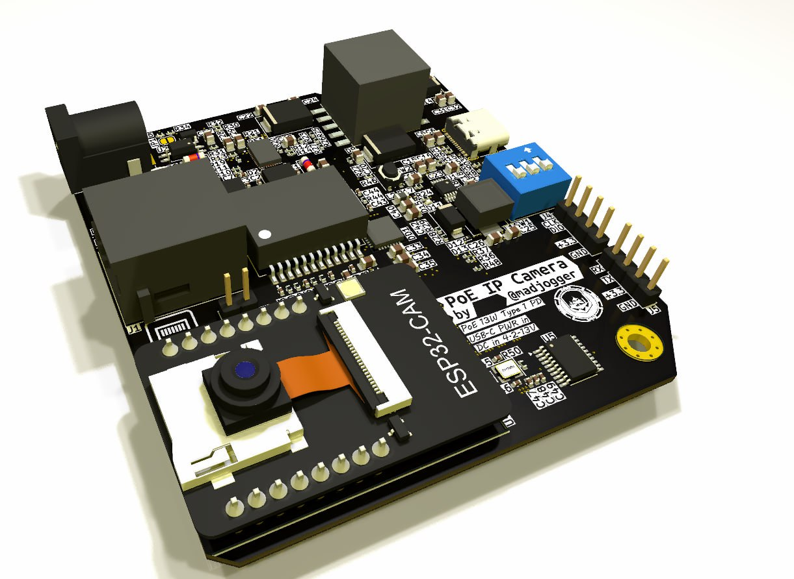

# PoE-IP-Camera

**IP-камера на ESP32-CAM с питанием от PoE (с гальванической развязкой), USB или DC-Jack и STM32-буфером между Ethernet и камерой.**

Плата сетевой камеры, где полезной нагрузкой выступает модуль **ESP32-CAM**, а связку с проводной сетью обеспечивает **Ethernet-контроллер**, подключённый к **STM32**, работающей буфером/мостом. Питание выбирается из трёх источников: **PoE**, **USB** или **DC-Jack (4.2–13 В)**. PoE-вход выполнен с гальванической развязкой. На ESP32-CAM реализуются веб-функции: Telegram-бот и API.



## Обзор

- **Название проекта:** PoE-IP-Camera
- **Камера/нагрузка:** модуль ESP32-CAM (веб-сервер, Telegram-бот, API)
- **Сетевой узел:** Ethernet-контроллер + STM32 в роли буфера
- **Питание:** PoE (с развязкой) / USB / DC-Jack 4.2–13 В
- **Особенность:** изолированный PoE-вход — первый опыт проектирования гальванической развязки

## Ключевые особенности

- **Три источника питания** — PoE, USB или DC-Jack (4.2–13 В) на выбор
- **PoE с гальванической развязкой** — изолированный преобразователь питания на стороне PoE
- **ESP32-CAM как полезная нагрузка** — камера + Wi-Fi/обработка, веб-функции (Telegram-бот, API)
- **STM32-буфер** — промежуточное звено между Ethernet-контроллером и ESP32-CAM
- **Проводная сеть** — Ethernet-интерфейс для стабильного подключения и питания по одному кабелю (PoE)

## Архитектура

```
Сеть (Ethernet/PoE) ──► Ethernet-контроллер ──► STM32 (буфер) ──► ESP32-CAM (камера + веб)
                                                                       │
PoE / USB / DC-Jack ──► узел питания (PoE с развязкой) ────────────────┘
```

Сигнал из сети поступает на Ethernet-контроллер, который связан с STM32. STM32 работает буфером/мостом и передаёт данные на модуль ESP32-CAM — основную полезную нагрузку, на которой реализуются веб-интерфейс, Telegram-бот и API. Питание камера может получать по тому же кабелю (PoE) либо от USB/DC-Jack.

## Питание

Реализован выбор из трёх источников:

- **PoE** — питание по сетевому кабелю с **гальванической развязкой** (изолированный преобразователь)
- **USB** — питание от USB-разъёма
- **DC-Jack** — внешний вход **4.2–13 В**

Развязанный PoE-узел проектировался впервые и занял заметную часть работы; результат подтвердил корректность подхода.

## Что на плате

| Блок | Назначение |
|---|---|
| ESP32-CAM | Камера и веб-нагрузка (Telegram-бот, API) |
| Ethernet-контроллер | Проводной сетевой интерфейс |
| STM32 | Буфер/мост между Ethernet и ESP32-CAM |
| Узел питания PoE | Изолированный преобразователь (гальваническая развязка) |
| Выбор питания | Коммутация PoE / USB / DC-Jack (4.2–13 В) |

## Применение

- Сетевая IP-камера с питанием по одному кабелю (PoE)
- Удалённое наблюдение с управлением через Telegram-бот / API
- Узел видеомониторинга для систем с проводной сетью
- Платформа для экспериментов с PoE и связкой Ethernet ↔ ESP32-CAM

## Среда разработки

- **Схема и плата:** KiCad
- **Прошивка ESP32-CAM:** PlatformIO / Arduino (веб-сервер, Telegram-бот, API)
- **Прошивка STM32:** STM32Cube / PlatformIO
